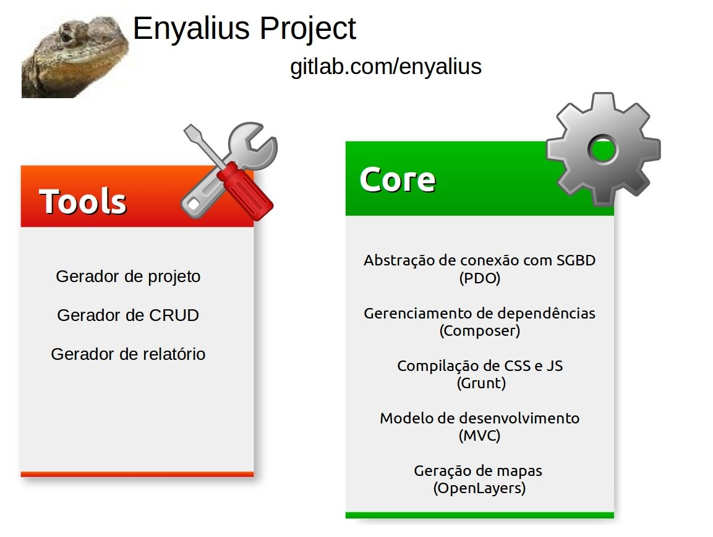

# CORE Server

O CORE_server é o núcleo de desenvolvimento em MVC do PHP. Esse núcleo é composto de pequenas
classes que tem por função melhorar o desenvolvimento de aplicações web. As libs são instaladas a partir 
do composer. 

O Core_client agora é parte integrante do core_server visto que os códigos são compilados pelo uglify usando o grunt e colocados nas pastas do cliente. 

Toda a lib tem uma classe espelho no Libs. Dessa forma esse mapeamento permite a troca de libs de forma mais transparente.

